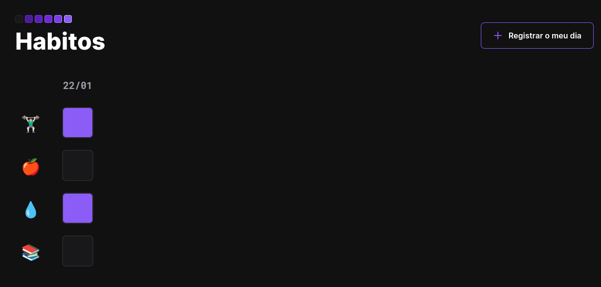

<h1 align="center"> Diário de Hábitos </h1>

  

 

## 🚀 Tecnologias

Esse projeto foi desenvolvido com as seguintes tecnologias:

- `HTML e CSS`
- `JavaScript`
- `Git`
- `Github`

## 💻 Projeto

Plataforma que armazena os dias e hábitos do dia a dia.

## Preview

## 🔖 Layout

Você pode visualizar o layout do projeto através [DESSE LINK](https://gabrielbritto1.github.io/setup-habitos/).

## :memo: Licença

Esse projeto está sob a licença MIT.

---

Feito com ♥ by Gabriel Britto.
